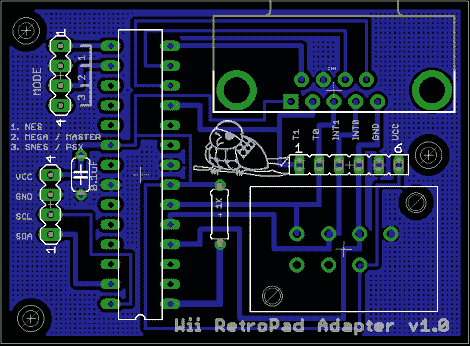

# 在 Wii 上使用经典游戏控制器

> 原文：<https://hackaday.com/2011/09/19/using-classic-game-controllers-with-a-wii/>

[Bruno]的[Wii retro pad 适配器](http://www.youtube.com/watch?v=F-TAdNzE4t8)被发送到 tip line，我们喜欢在我们的 Wii 上使用 Playstation 2、Genesis、NES 和 SNES 控制器的可能性。

虽然有将 NES 或 SNES 控制器连接到 Wii 的商业解决方案，但所有东西都连接到 GameCube 端口，并且没有用于世嘉或 Playstation 控制器的适配器。在他的建造中，[Bruno]使用 ATmega168 从经典控制器中读取数据，并将其翻译成 Wiimote [I2C 总线](http://wiibrew.org/wiki/Wiimote/Extension_Controllers)。把它想象成一个新的[经典控制器](http://wiibrew.org/wiki/Wiimote/Extension_Controllers/Classic_Controller)，它的外形和你 8 岁时认识并喜欢的一样。

[构建的示意图](http://hackaday.com/wp-content/uploads/2011/09/board_schematics_v10.png)非常简单，【布鲁诺】[已经公开了所有的软件](https://gitorious.org/wii-retropad-adapter)。甚至印刷电路板[也是单面的](http://hackaday.com/wp-content/uploads/2011/09/controllerboard.png)，看起来它将是自制印刷电路板的绝佳候选。没有迹象表明[布鲁诺]试图将他的创作货币化，所以他要么做得对，要么就大错特错。休息后，请查看此板的 Dualshock 2/Mario 3 演示。

[https://www.youtube.com/embed/F-TAdNzE4t8?version=3&rel=1&showsearch=0&showinfo=1&iv_load_policy=1&fs=1&hl=en-US&autohide=2&wmode=transparent](https://www.youtube.com/embed/F-TAdNzE4t8?version=3&rel=1&showsearch=0&showinfo=1&iv_load_policy=1&fs=1&hl=en-US&autohide=2&wmode=transparent)