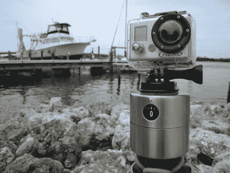

# 为延时摄影制作便宜的摇摄相机架

> 原文：<https://hackaday.com/2011/09/21/build-cheap-panning-camera-mounts-for-time-lapse-photography/>

平移延时摄影看起来总是很酷，但是整个“平移延时”装置妨碍了所有的乐趣。[Getawaymoments]不久前编写了一份教程，展示如何使用宜家鸡蛋定时器作为廉价且可有可无的淘洗装置，并且用一对更新的设计更新了他的说明。

他在宜家偶然发现了两款新的鸡蛋定时器，分别是售价 1.99 美元和 5.99 美元的 Stam 和 Ordning。Stam 是一个小的塑料模型，可以安装一个固定螺丝，大多数相机都可以安装在上面。一个小套管也可以安装在计时器的塑料底座上，允许它安装在任何标准的三脚架上。

Ordning 比它的塑料兄弟更结实，能够承受更多的虐待，因此价格也更高。在钻床上几分钟就可以为金属衬套腾出空间，这样 Ordning 也可以安装在任何三脚架上。

这种技术并不高科技，但我们对他用这些简单的厨房定时器所取得的效果印象深刻。就建造它们所需的成本和时间而言，它们肯定会让大多数其他淘洗设备望尘莫及。

继续阅读，观看一个简短的教学视频，演示如何构建自己的一个。

[通过[使](http://blog.makezine.com/archive/2011/09/diy-egg-timer-timelapse-panning-mount.html)

 <https://www.youtube.com/embed/BpMvIu4U3Tk?version=3&rel=1&showsearch=0&showinfo=1&iv_load_policy=1&fs=1&hl=en-US&autohide=2&wmode=transparent>

 </body> </html>