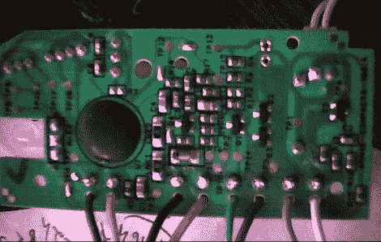

# 空气芯气味检测拆卸

> 原文：<https://hackaday.com/2011/09/21/air-wick-odor-detect-teardown/>

[Hunter 的]妻子从她最近的极限优惠券会议回家，带了一把免费的空气灯芯气味检测空气清新剂，因为他们有这么多的东西，他不得不把一个拆开，看看是什么让它们滴答作响。

外壳用熔化的搭扣固定，搭扣必须被切断，这使得拆卸成了单行道。打开后，他发现了三个白色标签的 AA 电池和一个 ARNIE COMPACT3 ISS.4 控制器板，以及一个环氧树脂密封的微控制器。一个类似品牌的传感器板连接到控制器上，他发现了一个带有内置喷嘴的螺线管，用于喷洒空气清新剂。

传感器板最激起了他的好奇心，经过一些研究，他非常确定 Air Wick 使用了应用传感器 VOC 空气质量模块来完成工作。这种微型传感器使用一种包含电极的特殊基板，当加热到 400 摄氏度以上时，它会测量感应层的电阻。电阻的变化会让空气清新剂知道是时候处理四处漂浮的气味了。

感谢【猎人】花时间把空气灯芯拆下来，让我们知道里面是什么！