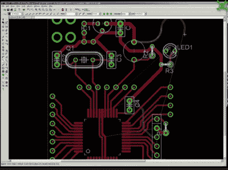

# 视频:Eagle CAD 布局

> 原文：<https://hackaday.com/2011/09/21/video-eagle-cad-layout/>

本周的视频是我们展示如何使用 Eagle CAD 的系列视频中的最后一个。今天，我们将查看程序的布局部分，并根据之前创建的原理图创建电路板。我们首先创建一个布局文件，然后将所有器件移到电路板上的适当位置。之后，[Jack]展示了如何布线。一路上，他谈到了他正在使用的工具以及使用它们的各种方法。最终结果是 PIC18F44J11 的原型板。

和其他视频一样，这个视频相当长，有 29 分钟，所以如果你想看的话，一定要花些时间去看。

在下周的视频中，我们将展示来自制造商的电路板，并就如何焊接进行指导。

如果您错过了我们之前的视频，您可以在这里找到它们:

[原理图第一部分](http://youtu.be/irE4oHB5fSc)
[原理图和定制部分创建](http://youtu.be/ZIJ1tml7rVU)
[CAM 处理器](http://youtu.be/yJQUImv-gq8)

我们还制作了许多补充视频，解释如何使用工具选项板中的许多工具。你可以在我们的 Youtube 频道上找到它们:

休息之后请看视频！
 <https://www.youtube.com/embed/s4-Ugi4y9lk?version=3&rel=1&showsearch=0&showinfo=1&iv_load_policy=1&fs=1&hl=en-US&autohide=2&wmode=transparent>

 </body> </html>