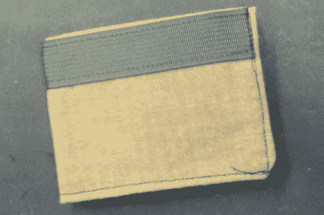

# DIY RFID 屏蔽钱包阻挡数据窃贼

> 原文：<https://hackaday.com/2011/09/22/diy-rfid-shielded-wallet-keeps-data-thieves-at-bay/>

[Serge]正在寻找一个新的钱包，但他担心 RFID 阅读器会窃取他的数据。他本可以去商店花 20-30 美元买一个屏蔽墙，但这有什么意思呢？相反，他决定自己做。

他用凯夫拉尔-诺梅克斯织物设计了钱包的大致结构。这种超强面料的断裂强度为 500 磅，但阻挡射频并不是它的强项。为了提供一些电磁屏蔽，[Serge]在 Kevlar 上添加了一层均匀的银环氧树脂，这有助于增强材料的强度。他开动缝纫机，在钱包外面加了一条尼龙带加固，然后他开始制作钞票袋和卡片夹。

最终的结果是一个普通但难以置信的坚固钱包，它肯定能保证他的各种 RFID 卡的安全。我们真的很欣赏这款钱包的朴实无华——没有闪光灯，全功能。干得好，我们要一个！