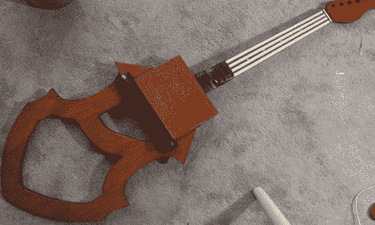

# 为什么这个磁性大提琴不是在 70 年代制造的？

> 原文：<https://hackaday.com/2011/09/22/why-wasnt-this-magnetic-cello-made-in-the-70s/>

【magnetovore】给自己做了一把[电子大提琴](http://magnetovore.wordpress.com/2011/09/10/magnetic-cello-v-4-1/)。他没有从 SD 卡里取出几个大提琴样本，而是用老学校的模拟方式。完工后的建筑真的令人印象深刻，让我们想知道为什么我们以前没有见过这样的东西。

[magnetovore]使用永久磁铁来弹奏每根“琴弦”。很多细节都在[这个帖子](http://magnetovore.wordpress.com/2011/08/31/the-provisional-patent-granted/)和【magnetovore】的[临时专利](http://magnetovore.files.wordpress.com/2011/08/electronic-musical-instrument-with-permanent-magnet-for-free-space-control-of-volume-ppa.pdf) (PDF 警告)。从我们收集的信息来看，每一串都是一个电阻式带状传感器，连接着一个压控振荡器。VCO 的输出被发送到由线圈和磁“弓”控制的可变增益放大器。

从视频来看(休息之后)，【magnetovore】已经有了大提琴声音的惊人再现。它在 C 弦的最低音部分有点像电子乐器，但经过一点点处理，它绝对可以被视为原声乐器。我们想知道为什么我们以前没有见过像这样的大提琴。VCO 和 VGA 是老 Moogs 甚至是古老的 ondes martenot 的支柱。早在[50 年代](http://www.electrotheremin.com/etfaq.htm)电子乐器上就安装了丝带控制器，所以我们真的不知道为什么磁性大提琴对我们来说是新的。如果任何一个 Hack A Day 的读者以前看过这样的东西，请在评论中留言。

 <https://www.youtube.com/embed/GBjeKJ98pEk?version=3&rel=1&showsearch=0&showinfo=1&iv_load_policy=1&fs=1&hl=en-US&autohide=2&wmode=transparent>

 </body> </html>