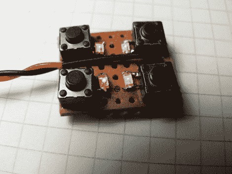

# ATtiny Hacks: ATtiny10 游戏–事半功倍

> 原文：<https://hackaday.com/2011/09/24/attiny-hacks-attiny10-game-doing-more-with-less/>

好吧，你有一个 6 引脚微控制器，有 1k 的程序存储器，32 字节的 SRAM，它不能用系统内编程器编程。你觉得可以用它来开发游戏吗？[Wrtlprnft]设法基于有四个按钮和四个 led 的小型设备开发了一个西蒙说游戏。从休息后的视频来看，我们会说他做到了！

这里有如此多的设计挑战。首先，总共只有六个引脚连接八个设备，工作意味着将每个 I/O 引脚*和*加倍，使用 reset 引脚作为加倍的 I/O。我们以前见过瞬时按钮与 led 在相同的引脚上，所以这并不太难工作。

但是，如果你使用复位引脚，你怎么闪存的事情呢？它不使用与其更大的同类产品相同的 ISP 编程协议，所以[Wrtlprnft]使用 ATmega1284P 对其进行编程，连接到三个 I/O 引脚，并使用晶体管在 reset 引脚上施加 12V 电压。但是仍然有写代码的问题。它有你期望找到的 32 个寄存器的一半。由于指令集的缩减，他最终放弃了 C 语言，直接去写汇编语言。这是他用汇编语言写的第一篇文章，也是学习诀窍的好方法。

它可能没有那么精致，但我们确实喜欢它，就像空手道斩西蒙说游戏一样，它有很多其他的花哨功能。

[https://www.youtube.com/embed/7bvOEQlV4Tk?version=3&rel=1&showsearch=0&showinfo=1&iv_load_policy=1&fs=1&hl=en-US&autohide=2&wmode=transparent](https://www.youtube.com/embed/7bvOEQlV4Tk?version=3&rel=1&showsearch=0&showinfo=1&iv_load_policy=1&fs=1&hl=en-US&autohide=2&wmode=transparent)