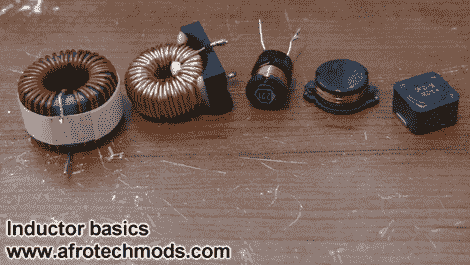

# 初学者概念:电感器视频四重奏

> 原文：<https://hackaday.com/2011/09/22/beginner-concepts-a-quartet-of-videos-on-inductors/>

电感器可以在你每天使用的许多设备中找到，但是如果你在你的项目中只和 DC 一起工作，你很可能从来不需要了解它们。现在，你有机会通过这个视频教程系列掌握基础知识。[Afroman]把休息后我们嵌入的四个短片放在一起。留出 15 分钟观看它们；你会很高兴你做了。

本系列的第一篇文章首先解释了电感器是一个线圈，其功能与电容器相似，但有一个主要区别。电容器储存电压，而电感器储存电流。在第二个视频中，[Afroman]将一些电感连接到方波发生器，然后使用示波器测量产生的电流特性。他展示了电感磁芯材料(空芯与铁氧体磁芯)之间的差异，并举例说明了使电感作为滤波器如此有用的特性。第三个视频介绍滤波电路，第四个视频最好地解释了驱动电机(感性负载)时为什么需要反激二极管。

[https://www.youtube.com/embed/NgwXkUt3XxQ?version=3&rel=1&showsearch=0&showinfo=1&iv_load_policy=1&fs=1&hl=en-US&autohide=2&wmode=transparent](https://www.youtube.com/embed/NgwXkUt3XxQ?version=3&rel=1&showsearch=0&showinfo=1&iv_load_policy=1&fs=1&hl=en-US&autohide=2&wmode=transparent)

[https://www.youtube.com/embed/VSMGnmQApA0?version=3&rel=1&showsearch=0&showinfo=1&iv_load_policy=1&fs=1&hl=en-US&autohide=2&wmode=transparent](https://www.youtube.com/embed/VSMGnmQApA0?version=3&rel=1&showsearch=0&showinfo=1&iv_load_policy=1&fs=1&hl=en-US&autohide=2&wmode=transparent) [https://www.youtube.com/embed/7jRl_XtyRCo?version=3&rel=1&showsearch=0&showinfo=1&iv_load_policy=1&fs=1&hl=en-US&autohide=2&wmode=transparent](https://www.youtube.com/embed/7jRl_XtyRCo?version=3&rel=1&showsearch=0&showinfo=1&iv_load_policy=1&fs=1&hl=en-US&autohide=2&wmode=transparent)