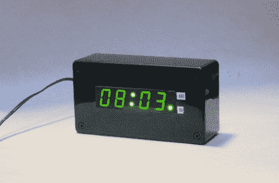

# 关掉你的闹钟！

> 原文：<https://hackaday.com/2011/09/23/flip-off-your-alarm-clock/>

[科尔宾]讨厌在黑暗中摸索他的警报响，寻找关闭开关。他对普通的闹钟非常厌烦，所以他决定自己制作一个更简单的计时器。

FlipClock 位于一个简单的黑色塑料盒中，没有任何按钮。当闹钟响起时，你所要做的就是把闹钟翻过来使它失灵。当时钟颠倒时，数字会使用加速度计自动校正，指示灯 LED 会让您知道闹钟已经关闭。

该时钟基于一个螺旋桨芯片，它管理时钟的所有操作。科尔宾没有使用实时时钟集成电路，而是使用 GPS 模块来保持准确的时间，我们不记得以前在闹钟中见过这种东西。这是一件好事，因为没有按钮来设置时钟。事实上，也没有设置闹钟的按钮——闹钟被配置为在每天的同一时间发出警报。

虽然这个闹钟对于像我这样长期滥用贪睡按钮的人来说太危险了，但它仍然是一个有趣的概念！

请观看下面的视频，了解 FlipClock 的运行情况。

[https://www.youtube.com/embed/SJ3GjYTnEAE?version=3&rel=1&showsearch=0&showinfo=1&iv_load_policy=1&fs=1&hl=en-US&autohide=2&wmode=transparent](https://www.youtube.com/embed/SJ3GjYTnEAE?version=3&rel=1&showsearch=0&showinfo=1&iv_load_policy=1&fs=1&hl=en-US&autohide=2&wmode=transparent)