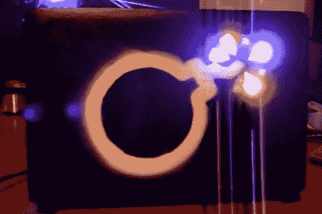

# 为您的上网本盖子添加一些 LED 增强功能

> 原文：<https://hackaday.com/2011/09/23/add-some-led-enhancement-to-your-netbook-lid/>

[Mathieu]需要打开他的宏基 Aspire One 进行硬盘更换，并决定在那里添加一点活力。上图是用 RGB LEDs 和喷漆模板装饰的[上网本的盖子](http://www.limpkin.fr/index.php?post/2011/09/22/Having-fun-with-a-Teensy-and-an-Acer-Aspire-One)。

他之前在易贝购买了一套表面贴装 RGB 包，并认为它们非常适合这次黑客攻击。拆下机箱后，他发现通过使用柔性印刷电路板，他可以将 led 安装在里面，并将连接传递到主计算机外壳。导线连接到一块小小的板子上，板子用热熔胶固定住。[Mathieu]拔下 USB 连接器并将跳线焊接到计算机的一个端口上。在休息后的视频中，你可以看到他使用编程软件给 Teensy 写一些代码，驱动 led。我们希望看到它设置为监听串行通信并做出相应的反应。这样你可以用它来通知，作为音频 VU 米，跟踪种子的进展，等等。

 <https://www.youtube.com/embed/34Rva1s6eKE?version=3&rel=1&showsearch=0&showinfo=1&iv_load_policy=1&fs=1&hl=en-US&autohide=2&wmode=transparent>

 </body> </html>