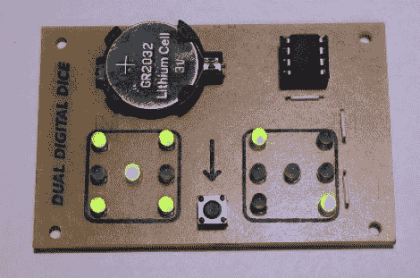

# 两个骰子，一个 8 针 UC

> 原文：<https://hackaday.com/2011/09/27/attiny-hacks-two-dice-one-6-pin-uc/>

[Mike Shegedin]在这个基于 13 年的骰子项目中充分利用了 8 针微控制器。由于最多有六个 I/O 引脚(包括使用 reset 引脚作为 I/O)，他需要几个技巧来驱动 14 个 led，并使用瞬时按钮进行用户输入。我们当然熟悉这里的概念，但还是花了相当长的时间才弄清楚[Mike]发布的示意图是怎么回事。

你可能已经猜到他用 Charlieplexing 驱动的 led 比他的管脚还多。但是当我们开始看布局时，我们认为他画错了原理图，因为有六对 led，每对中的两个二极管不是反向偏置的，而是并联的。再加上他的电池是反向连接的。经过几分钟的研究，灯泡终于亮了。骰子成对添加点数(骰子每侧的点),除了中间的点数。这意味着您只需控制每个骰子的四条生产线(三对加上中心点)。有两种方法可以解决这一问题，您可以使用四行两列的传统多路复用技术，也可以将每个芯片的两组 led 反向偏置，并使用 Charlieplexing。前者更容易编程，后者为您节省了一个 I/O 引脚，意味着[Mike]不需要使用 reset 引脚作为 I/O 引脚。

这是对我们已经看到的骰子项目集合的一个巧妙的补充，比如[无电池骰子](http://hackaday.com/2011/09/14/attiny-hacks-look-ma-no-batteries/)，以及[attini 2313 供电骰子](http://hackaday.com/2011/09/16/attiny-hacks-roll-2d6-with-an-attiny/)。