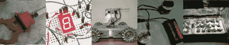

# 2011 年 9 月 24 日每周综述

> 原文：<https://hackaday.com/2011/09/24/weekly-roundup-92411/>

如果你错过了它们，这里是过去一周最受欢迎的帖子。

我们最受欢迎的帖子是关于一个手工制作的安全机器人，任何优秀的黑客都会为此感到骄傲。这个机器人是由一个父女团队建造的，它有一个有趣的完整传动系统，可以在任何时间向任何方向行驶。

我们的[下一个最受欢迎的帖子](http://hackaday.com/2011/09/20/8-breadboard-hacks-to-make-life-easier/)是关于八个试验板的技巧，让你用你的试验板做比你以前认为可能的更多的事情。

接下来是一篇关于如何处理没电的笔记本电脑电池的文章。令人惊讶的是，并不是所有的细胞都死了，所以其中一些细胞仍有使用寿命。

接下来我们有一个关于电子大提琴的帖子，它结合了琴弓的磁性拾音器和琴弦的电阻条。甚至还有一段正在播放的视频。

最后，对于那些希望一年到头都在室内种植的人，我们有一个关于水培设置的帖子。