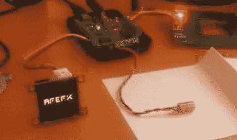

# 使用有机发光二极管-128-G1 显示器

> 原文：<https://hackaday.com/2011/09/25/working-with-the-%c2%b5oled-128-g1-display/>

如果你还不熟悉 4D 系统公司的有机发光二极管-128-G1 显示器，[Gary]整理了[一个项目，展示了它提供的一些功能](http://www.picbasic.co.uk/forum/content.php?r=257-Displaying-Videos-and-Images-on-4Dsystems-uOLED-Serially)。这是一个智能显示器，有自己的板载微控制器和一个 microSD 插槽。SD 卡存储图像和视频数据，而微控制器根据接收到的简单串行命令显示这些数据。这意味着你可以将它连接到计算机或微控制器上，用最少的编程工作显示静止或动画序列。我们在休息后嵌入了一个视频，或者你可以看看去年的这个[老虎机项目](http://hackaday.com/2009/10/01/skip-vegas-with-this-bs-slot-machine/)，它使用了相同的模块。

[Gary]正在使用用 PIC Basic Pro 编程的 PIC 微控制器。但是大部分的工作都是通过一个叫做 Graphics Composer 的 4D 系统程序完成的。您构建出想要在屏幕上看到的图像和动画，然后将其格式化以用于显示并写入 SD 卡。[Gary]提到该卡不是使用传统的文件系统写入的，所以如果你知道另一种向该卡写入数据的方法，我们很乐意在评论中听到。图像编辑软件还会发出一系列必要的命令，将你新制作的图像显示出来。

[https://www.youtube.com/embed/0tagVOV9EE8?version=3&rel=1&showsearch=0&showinfo=1&iv_load_policy=1&fs=1&hl=en-US&autohide=2&wmode=transparent](https://www.youtube.com/embed/0tagVOV9EE8?version=3&rel=1&showsearch=0&showinfo=1&iv_load_policy=1&fs=1&hl=en-US&autohide=2&wmode=transparent)