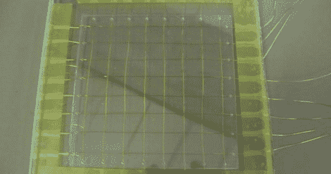

# 电容检测教程

> 原文：<https://hackaday.com/2011/09/26/capacitive-sensing-tutorial/>

【Bertho】参加 74xx 逻辑大赛的投稿真是让人印象深刻。他只使用 74xx 和 40xx 逻辑芯片设计了一个电容感应触摸板[。我们对这一构建印象深刻，他的文章是我们见过的关于电容检测的最佳资源之一。](http://www.vagrearg.org/?p=capsens1)

设计电容式触摸板有两种方法。第一种选择是通过 [RC 电路](http://en.wikipedia.org/wiki/RC_circuit)施加电压。测量电压-时间曲线，你就有了电路电容的测量值。第二种方法是设置一个 RC 电路，在达到 C 阈值后改变极性。微处理器只使用其中一种方法(AVR 使用第一种，PIC 使用第二种)，但[Bertho]决定实现这两种方法，原因不明，我们仍然尊重。

[Bertho]设计的电路仅使用 74xx 逻辑芯片就有 30MHz 的时钟，这本身就是一个惊人的壮举。制作了一个 8×8 通道面板，整个构建通过 RS-232 连接到一台计算机。

完成的构建足够好，有 64 点的分辨率，能够很好地检测邻近。触摸板甚至能够识别何时将笔放在面板上。休息后，请观看视频，了解这一令人惊叹的构建过程和演示。

 <https://www.youtube.com/embed/Y-tAlHUfbPo?version=3&rel=1&showsearch=0&showinfo=1&iv_load_policy=1&fs=1&hl=en-US&autohide=2&wmode=transparent>

 </body> </html>