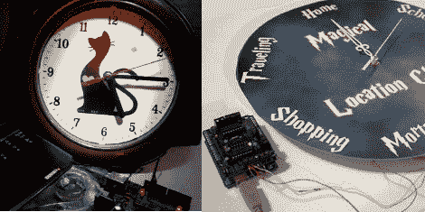

# Arduino 电路板通过线圈注入控制廉价的时钟

> 原文：<https://hackaday.com/2011/09/27/arduino-boards-control-cheap-clockworks-via-coil-injection/>

这里有几个时钟使用 Arduino 板来控制廉价的时钟工作。这个概念很简单，也许最好用关于这个主题的文章来概括。事实证明，这些时钟由线圈驱动，形成了一个非常类似于步进电机的设备。如果你在电磁线圈的两端各焊接一根电线，然后把它们接到一个微控制器上，你就可以改变时钟的滴答速度。只需将一个引脚驱动至高电平，将另一个引脚驱动至低电平，然后在下一个时钟周期反转极性。

你在右边看到的钟是一个商店买的便宜货。图像底部几乎不可见的 Arduino 每秒发送一次脉冲。但正如你在休息后的视频中看到的，按住一个按钮会快进时间。[Sodanam]发布了他的代码以及硬件黑客本身的图片。

左边是一匹不同颜色的马。这是一个模仿《哈利·波特》系列中韦斯莱家时钟的[时钟。时钟技巧是相同的，但是 Arduino 使用 GPS 数据和 NOAA 天气信息来设置状态。](http://www.instructables.com/id/Magical-Location-Clock/)

[https://www.youtube.com/embed/gpxrngdSTZk?version=3&rel=1&showsearch=0&showinfo=1&iv_load_policy=1&fs=1&hl=en-US&autohide=2&wmode=transparent](https://www.youtube.com/embed/gpxrngdSTZk?version=3&rel=1&showsearch=0&showinfo=1&iv_load_policy=1&fs=1&hl=en-US&autohide=2&wmode=transparent)

[感谢因弗诺斯和迈克尔]