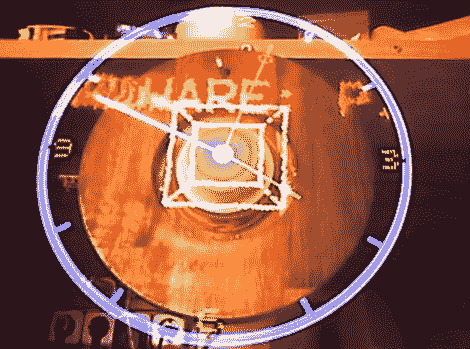

# 惊人的 RGB 视点时钟

> 原文：<https://hackaday.com/2011/09/27/amazing-rgb-pov-clock/>

在这里，我们对 [POV time pieces](http://www.propellerclock.vac.hu/) 并不陌生，但关于它们的一些东西永远不会过时。无论他们是使用[一圈 led](http://hackaday.com/2008/10/17/led-pov-hard-drive-clock/)来绘制时钟指针，还是使用[一个复杂切割的硬盘盘](http://hackaday.com/2011/07/10/slick-16-segment-pov-hard-drive-clock/)来复制 LCD 段，我们都喜欢看到他们。[大卫]送来了这个硬盘 POV 时钟，它是由一个叫[Kly]的家伙建造的，非常漂亮。

[Kly's]“螺旋桨”POV 时钟因电路板的设计而得名。该板安装在硬盘主轴上，旋转起来很像飞机的螺旋桨。结构细节很少，但从我们可以发现的情况来看，它基于 PIC32MX 微控制器，用于控制电路板上安装的 66 个 SMD RGB LEDs。

正如你在下面的视频中看到的，紧密排列的 led 产生了一些非常惊人的视觉效果。

除了观看下面的视频，一定要去他的 Youtube 频道看一些显示 RGB 视点时钟运行的视频。

[https://www.youtube.com/embed/tMTSMNW22EM?version=3&rel=1&showsearch=0&showinfo=1&iv_load_policy=1&fs=1&hl=en-US&autohide=2&wmode=transparent](https://www.youtube.com/embed/tMTSMNW22EM?version=3&rel=1&showsearch=0&showinfo=1&iv_load_policy=1&fs=1&hl=en-US&autohide=2&wmode=transparent)