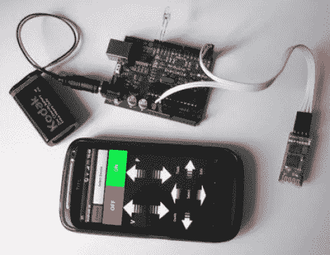

# 蓝牙到红外遥控转换器原型

> 原文：<https://hackaday.com/2011/09/29/prototyping-a-bluetooth-to-ir-remote-control-translator/>

[James]是那些寻求用一个设备控制一切的人之一。他选择的工具是一部安卓手机，开箱即用就能做很多事情。但他从未对它缺乏红外遥控能力感到满意。他通过[建立一个蓝牙到红外转换器](https://sites.google.com/site/jsrsprojects/androidir)修复了这个功能缺口。

他用于原型的硬件非常简单。一个来自易贝的廉价串行蓝牙调制解调器让他可以连接到他的手机。Arduino 板监听来自调制解调器的数据，并将输入的命令转换为红外 LED 上的闪烁。瞧，他可以用手机控制地铁。

我们喜欢这种黑客的潜力。蓝牙模块采用 3.3V 供电，读取串行数据和闪烁 LED 极其简单。你应该可以使用一个小的 uC，比如说 ATtiny13，和一个 3.3V 的稳压器来使模块小型化。我们可以看到这种插头插入电视背面的 USB 端口以获取电源，并通过电线延伸将 LED 放置到位。唯一的不足是，当以这种方式获取电力时，无法远程打开电视。

远程代码存储起来也不是特别大。因此，这将很容易扩展到所有红外兼容的家庭娱乐设备的完全控制。你只需要[一个工具来发现遥控代码](http://hackaday.com/2011/09/26/how-to-decode-ir-remote-control-signals-with-your-pickit-2/)。

[https://www.youtube.com/embed/KhK3xKQ8gto?version=3&rel=1&showsearch=0&showinfo=1&iv_load_policy=1&fs=1&hl=en-US&autohide=2&wmode=transparent](https://www.youtube.com/embed/KhK3xKQ8gto?version=3&rel=1&showsearch=0&showinfo=1&iv_load_policy=1&fs=1&hl=en-US&autohide=2&wmode=transparent)