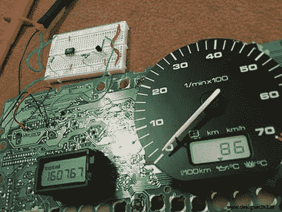

# 黑掉你汽车的多功能显示器

> 原文：<https://hackaday.com/2011/09/29/hacking-your-cars-multifunction-display/>

[史蒂夫]有一辆更老的第三代大众高尔夫，正如那些拥有过的人肯定知道的那样，心爱的 VR6 发动机很棒，但很挑剔。他说 VR6 在油温方面特别挑剔，所以他的日常工作包括在启动汽车时[按五次 MFA 开关](http://www.designer2k2.at/mods/uebersicht/66-mfa-switcher.html)以在显示屏上显示油温。很明显，过了一段时间后这就过时了，所以他装配了一个小电路来为他做切换。

他从仪表板上取下仪表组，然后找到对应于 MFA 显示开关的针脚。他用一台 ATtiny12 组装了一个小电路，每次启动汽车时，这个电路都会自动为他拨动开关。由于他的解决方案使用的零件如此之少，所以在重新安装之前，他可以很容易地将他的发明藏在仪表组后面。

现在，每次他进入汽车，他都可以很快看到发动机的油温，而不用担心显示屏。