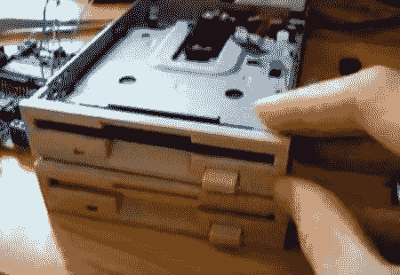

# 双软驱播放的星球大战帝国进行曲

> 原文：<https://hackaday.com/2011/10/02/star-wars-imperial-march-played-by-dual-floppy-drives/>

尽管许多人用即兴电子设备制作了某种音乐，但很少有人能像这首由两个软驱播放的《星球大战》中的《帝国进行曲》听起来那么酷。按照[Pawel]的说法，“这没什么新鲜的”，而且相当简单。这可能是真的，因为我们以前在这里展示过一个[帝国行军播放软盘驱动器](http://hackaday.com/2008/06/07/more-hardware-music/)，但它只有一个驱动器。虽然可能不是[伦敦交响乐团](http://starwars.wikia.com/wiki/London_Symphony_Orchestra)，但两个驱动器一起听起来相当不错！

据他说，FDD 有一个相当简单的界面。要移动磁头，只需拉低 DRVSB 引脚，然后在下降沿激活 STEP 引脚。这将使磁头根据 DIR 引脚状态向一个方向移动。在这种情况下，ATMega 微控制器正在移动一切。在这里可以找到这次攻击中使用的引脚的解释[。](http://www.interfacebus.com/PC_Floppy_Drive_PinOut.html)

虽然表面上看起来像是一个令人生畏的黑客，但用一些旧硬件和 Arduino 或其他控制器来尝试这样的东西可能是一个不错的项目！[Pawel]确实有想法把一个 5 1/4 英寸和 8 英寸的驱动器连接起来，组成一个完整的 FDD 管弦乐队，所以我们迫不及待地想看看他想出什么！

 <https://www.youtube.com/embed/yHJOz_y9rZE?version=3&rel=1&showsearch=0&showinfo=1&iv_load_policy=1&fs=1&hl=en-US&autohide=2&wmode=transparent>

 </body> </html>