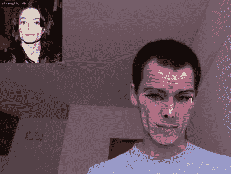

# 由于 OpenFrameworks 和一些插件，可以进行数字整形手术

> 原文：<https://hackaday.com/2011/09/30/get-digital-plastic-surgery-thanks-to-openframeworks-and-some-addons/>

在一些 openFrameworks 视频插件的帮助下，凯尔·麦克唐纳正在尝试一种新的面貌，至少在数字世界是这样。他正与阿图罗·卡斯特罗合作，尽可能真实地进行实时面部替换。你可以看到[阿图罗] [自己的视频](http://vimeo.com/29279198)对面部变化的阴影和颜色有不同的看法，这使他们比[凯尔]能够完成的更不真实(见休息后的剪辑)。

这种设置依赖于由杰森·萨拉吉开发的面部追踪软件。这个包被包装在 ofxFaceTracker 中(已经在本文的顶部链接了),这使得它可以很好地与 openFrameworks 一起使用。从那里，它只是一个图像处理的问题。如果你认为你已经准备好迎接挑战，那就拿起你自己的源代码，开始工作吧。我们被这看起来如此真实所震惊，即使当(凯尔)抓住他的脸颊并把它们展开。如果有人能够修复采样人脸边缘的一些伪影，这就可以在视频会议中使用了。

这有点让我们想起在 *[《跑男》](http://www.youtube.com/watch?v=-ceegnWSENQ)* 中看到的技术。

【维梅奥 http://vimeo.com/29348533 w = 470】

[谢谢卢克]