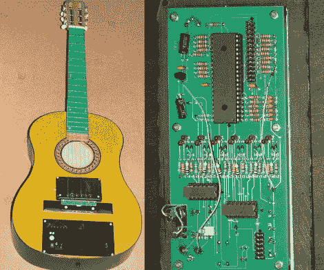

# 全品吉他 MIDI 控制器

> 原文：<https://hackaday.com/2011/09/29/fully-fretted-guitar-midi-controller/>

[安迪]很久以前偶然发现了这个[吉他 midi 控制器项目](http://tryndelka.narod.ru/index_e.htm)，并决定[给我们发一个关于它的提示](http://hackaday.com/contact-hack-a-day/)。英语版本，翻译自俄语原文，易于理解，记录了从第一个原型到你上面看到的版本的构建过程。它可以通过标准的 MIDI 电缆连接，然后用来控制你想要的任何东西。唯一缺少的是传输速度数据的能力，但这肯定不是一个交易破坏者。

该装置有两个感官部分。第一个是一组拾音器，可以在桥附近的琴弦下看到。它们的工作原理类似于标准的磁性拾音器，但不是从琴弦上拾取的音高来推断品数据，而是为每根琴弦的每一品都提供了第二个传感器机制。由于琴弦是由金属制成的，因此可以根据连续性感应来检测哪个品被按下。当然，这意味着每个品之间需要一个导体，这就是为什么指板被印刷电路板取代的原因。所有这些数据被收集起来，然后通过 PIC 16F74 微控制器发送到 MIDI 设备。

如果这让你想要更多的吉他技巧，不要错过这个[在每个品之间添加可寻址的 LEDs】。](http://hackaday.com/2011/04/19/guitar-teaches-you-to-play-using-leds/)