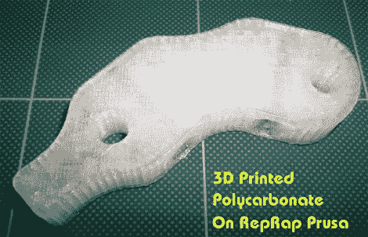

# 使用带有 RepRap 的聚碳酸酯长丝

> 原文：<https://hackaday.com/2011/09/30/using-polycarbonate-filament-with-a-reprap/>

[Rich]找不到 RepRap 所有者使用聚碳酸酯作为 3D 打印源材料的任何实例。他通过[运行多项聚碳酸酯打印测试](http://richrap.blogspot.com/2011/09/indestructamendel-polycarbonate-3d.html)填补了这一知识空白。聚碳酸酯是一种非常耐摔的塑料，但它仍然相当柔软。如果足够努力，它可以弯曲和拉伸，但很难打破材料。

聚碳酸酯测试线轴是为此项目特别定制的。[丰富]采购 1.6 毫米灯丝，因为 3 毫米材料很难缠绕。它在 280-300 摄氏度的温度范围内熔化，这是他通过热端挤出机设计达到的。打印出来的材料有点模糊，这可能是由于加热过程本身，或者由于挤出机反转(他不太确定是什么原因造成的)。但是正如你在上面和休息后的视频中所看到的，它确实是一种可行的印刷媒体。

 <https://www.youtube.com/embed/_JvBJcemPHM?version=3&rel=1&showsearch=0&showinfo=1&iv_load_policy=1&fs=1&hl=en-US&autohide=2&wmode=transparent>

 
[谢谢 Marnargulus]
 </body> </html>