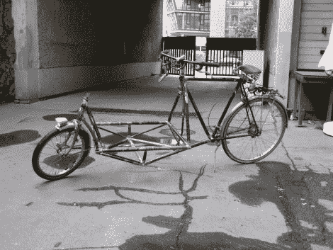

# 非常便宜的升级货运自行车

> 原文：<https://hackaday.com/2011/10/01/incredibly-cheap-upcycled-cargo-bike/>

什么东西有两个轮子，由五辆不同的自行车组成，可以把你所有的东西运送数英里？

[【保罗蓝的】DIY Lastenrad，就是这样。](http://upcycledbike.wordpress.com/) [(谷歌翻译)](http://translate.google.com/translate?hl=en&sl=de&tl=en&u=http%3A%2F%2Fupcycledbike.wordpress.com%2F)

Lastenrad 是一种货运自行车，负载位于骑手的前面，而不是被拖在后面。[Paul]想要一辆在镇上拖运东西的车，他没有买，而是自己造了一辆。我们特别喜欢这款自行车的一点是，它借用了其他五款年久失修的自行车的零件。这种重复使用是我们真正能够做到的。

[Paul]估计总建造成本低于 50 欧元，考虑到他的 Lastenrad 是多么有用，这真是太棒了。在骑了大约 100 公里后，他说这款车操控非常好，即使满载，也非常容易在镇上行走。

继续阅读，观看自行车首次试驾的视频。

[https://www.youtube.com/embed/su3qGKKjo9M?version=3&rel=1&showsearch=0&showinfo=1&iv_load_policy=1&fs=1&hl=en-US&autohide=2&wmode=transparent](https://www.youtube.com/embed/su3qGKKjo9M?version=3&rel=1&showsearch=0&showinfo=1&iv_load_policy=1&fs=1&hl=en-US&autohide=2&wmode=transparent)