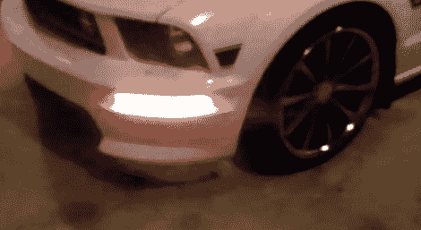

# 动画转向灯给你的汽车增加了一点赛昂人的感觉

> 原文：<https://hackaday.com/2011/10/03/animated-turn-signals-add-a-little-bit-of-cylon-to-your-automobile/>

[StarfireMX]为他的野马制造了一个奇妙的转向灯替代品。当他打开转向灯时，他汽车的前角会出现一个琥珀色发光二极管的追逐图案。很酷，据我们所知，这仍然是合法的。但是一旦他进入私人领地，[StarfireMX]就可以对这些替代品多一点乐趣。led 实际上是完全可寻址的 RGB 模块。他们可以显示各种颜色和图案，通过他还建造了一个触摸屏装置进行无线控制。

转向灯单元和遥控器都由 Arduino 驱动，使用 XBee 模块进行无线通信。打开引擎盖，你会发现更多闪亮的灯来突出引擎，这些灯也可以用遥控器来调节。

休息后不要错过演示视频。在视频的结尾，你可以看到控制器是如何安装在烤架后面的重型 Velcro 上的。在项目箱内有一个电压调节器，可以将 12V 降至 5V，并可以输出高达 4 安培的电流，以确保 led 有足够的电流。

 <https://www.youtube.com/embed/zWn8yI-qdp8?version=3&rel=1&showsearch=0&showinfo=1&iv_load_policy=1&fs=1&hl=en-US&autohide=2&wmode=transparent>

 
[谢谢鲁迪]
 </body> </html>