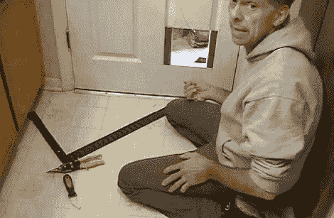

# 如何打造自己的猫门

> 原文：<https://hackaday.com/2011/10/02/how-to-build-your-own-cat-door/>

[迪诺]继续他的每周黑客目标，为他的宠物建一个猫门。他在附近有一家[人类栖息地转卖店](http://www.habitat.org/restores/)，正在以半价出售商品。于是他拿起一扇六面门，开始工作。

第一步是画出开口，并用竖锯切割。一旦他完成了，还有一些加固工作要做，因为这是一个空心门。因为他已经切掉了一部分门的底部，以适应他的门框，所以他有一些厚度合适的木材。那个钻头用胶水和一些圆头钉固定在开口的顶部和底部。用不同的碎片在侧面做同样的工作，然后门被挂在开口处，到达上面看到的项目中的点。

在这里[迪诺]准备添加一个皮瓣来覆盖开口。他用丙烯酸树脂做翻盖，因为它质轻且透明。一块钢琴铰链可以很容易地向两个方向摆动。最后一点是一个磁铁，它使用磁性橱柜插销的部件来防止翻盖在微风中摆动。他刚把翻盖放好，一只勇敢的小猫就试了试。

希望他没有那种导致其他黑客造[面部识别猫门锁](http://hackaday.com/2010/05/14/cat-door-unlocks-via-facial-recognition/)的害虫。

 <https://www.youtube.com/embed/c9Tt7Hodjck?version=3&rel=1&showsearch=0&showinfo=1&iv_load_policy=1&fs=1&hl=en-US&autohide=2&wmode=transparent>

 </body> </html>