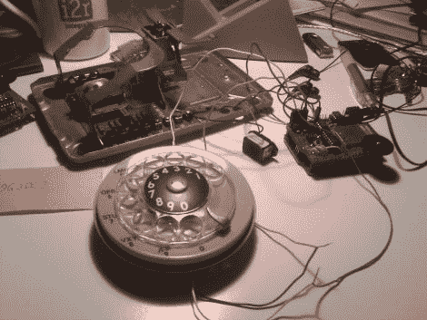

# Freakyphone 有个谜题给你！

> 原文：<https://hackaday.com/2011/10/03/freakyphone-has-a-puzzle-for-you/>

[哑剧演员]喜欢为他的朋友制作拼图和游戏来玩，经常使用回收的电子产品来构建它们。他一直在考虑一个基于声音的游戏有一段时间了，当他在一个车库拍卖中偶然发现一个旧的旋转电话，这将是他心目中的完美。

他称他的发明为“Freakyphone ”,游戏的目标是通过一系列听觉线索来猜测一个历史人物的名字。这款手机使用 Arduino 构建，使用 Adafruit 的声音屏蔽播放音频。虽然他最终无法让手机铃声正常工作，但[Mime]表示，整个制作过程相对容易。

激活时，手机会发出蜂鸣声，提示玩家拿起听筒。在介绍完游戏后，手机会响起额外次数的随机声音片段，提示玩家输入历史人物的名字。如果玩家使用转盘正确地输入了这个人的名字，他们会收到一声“胜利的声音”,游戏结束。

看到有人只是为了好玩而为他们的朋友制作小工具总是令人愉快的——干得好！

继续阅读，观看展示 Freakyphone 如何构建的视频以及游戏演示。

 <https://www.youtube.com/embed/GdDxavA3RRY?version=3&rel=1&showsearch=0&showinfo=1&iv_load_policy=1&fs=1&hl=en-US&autohide=2&wmode=transparent>

 </body> </html>