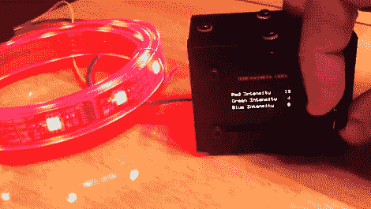

# 通过构建控制模块来磨练您的技能

> 原文：<https://hackaday.com/2011/10/03/hone-your-skills-by-building-control-systems/>

如果你问我们，没有什么可以替代边做边学。但是获得新技能最困难的部分往往是想出一个利用它们的项目的想法。[Mike Rankin]想要开发一个使用激光切割丙烯酸树脂的项目，并决定[为 RGB LED 灯条](https://sites.google.com/site/0miker0/arduino-led-controller)建造一个控制箱。他在 SolidWorks 中进行了一些对象建模的实践，并看到了最终构建的过程。但这也让他探索了他几乎没有经验的微控制器编程领域。

他使用的 LED 灯条依赖于 HL1606。这是一个 SPI 可寻址芯片，我们看到[最近在许多项目中出现](http://hackaday.com/2011/09/29/what-has-114-leds-and-is-always-running/)。通过数据总线发送红色、绿色和蓝色值非常简单，这使得[Mike]可以尝试编程菜单和子菜单。控制器接受来自可点击旋转编码器的输入。这些设置显示在有机发光二极管的屏幕上，所有的硬件都舒适地放在他定制的外壳中。

不要错过休息后嵌入的演示视频。

 <https://www.youtube.com/embed/TWNkqsYFRzA?version=3&rel=1&showsearch=0&showinfo=1&iv_load_policy=1&fs=1&hl=en-US&autohide=2&wmode=transparent>

 </body> </html>