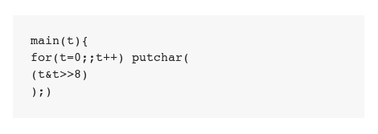

# AVR Chiptune 项目将这个简单的代码转换成音乐

> 原文：<https://hackaday.com/2011/10/03/avr-chiptune-project-turns-this-simple-code-into-music/>

[Mark]见过一些算法音乐生成的例子，这些例子使用一些简单的代码，产生听起来复杂的结果。显然，像这样将代码输出直接传输到 Linux 机器上的音频设备是可能的，但是[Mark]决定走不同的方向。他的项目让你使用 AVR 微控制器把简单的算法当作音频播放。

这方面的代码工作非常简单，但硬件实现才是有趣的地方。从表面上看，[Mark]没有可用的组件来构建一个将 PWM 用作音频信号的滤波器。因为他是业余爱好者，他抓起手边的一些无线电设备，迅速做了一个替代品。他正在将来自 Arduino 的脉冲宽度调制信号输入用于高空气球遥测的电路板上的压控振荡器。该板广播的信号被他的无线电接收器接收，并在一些扬声器上播放。

撇开 Rube-Goldberg 装置不谈，这个效果非常有趣，你可以在视频剪辑的后半部分听到，这是我们在跳跃之后嵌入的。

[https://www.youtube.com/embed/jaTzSXN8uJU?version=3&rel=1&showsearch=0&showinfo=1&iv_load_policy=1&fs=1&hl=en-US&autohide=2&wmode=transparent](https://www.youtube.com/embed/jaTzSXN8uJU?version=3&rel=1&showsearch=0&showinfo=1&iv_load_policy=1&fs=1&hl=en-US&autohide=2&wmode=transparent)