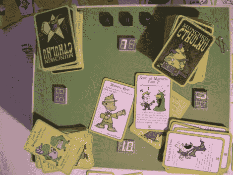

# 游戏记分牌和储物盒合二为一

> 原文：<https://hackaday.com/2011/10/04/gaming-scoreboard-and-storage-box-in-one/>

这个[游戏收纳盒还会为你记录分数](http://www.instructables.com/id/Build-an-electronic-score-keeperstorage-box/)。[马库斯]建造它是为了玩[纸牌游戏 Munkin](http://en.wikipedia.org/wiki/Munchkin_(card_game))，但一些聪明的编程可以适应它的大多数需求。硬件围绕 ATtiny2313 进行思考，MAX7219 驱动 7 段显示器。每个玩家都有自己的两位数分数读数，这对于这个只跟踪从-9 到 10 的分数的游戏来说是完美的。

在休息后的视频中，您可以看到[Marcus']对用户界面的解释。一名球员担任比赛的记分员。该人使用三个按钮根据需要调整分数，并移动当前玩家标记，在其中一个显示器上表示为小数点。按下所有三个键将使装置进入编程模式。这可以让你选择球员的数量和他们的位置，以及在必要时调整比分。

 <https://www.youtube.com/embed/adz5DrFz8_I?version=3&rel=1&showsearch=0&showinfo=1&iv_load_policy=1&fs=1&hl=en-US&autohide=2&wmode=transparent>

 </body> </html>