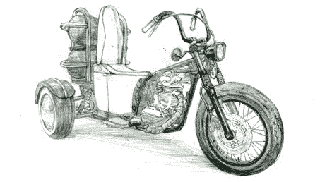

# 可持续发展秘诀:便便的力量

> 原文：<https://hackaday.com/2011/10/06/sustainability-hacks-poop-power/>

是的。那是一辆带厕所的机动三轮车。让那件事过去一分钟。哦，这不是一个永远不会建成的东西的概念草图。厕所自行车 Neo 无疑是真实存在的。

沼气，或从腐烂的植物或动物粪便中产生的甲烷，是一种合法的能源形式。来自垃圾填埋场的废气约占美国天然气消耗量的 0 . 5%。佛蒙特州甚至有一个可再生能源的 T2 奶牛发电项目。也就是说，这是三轮车上的厕所。

这辆自行车是为日本卫浴设备制造商 TOTO 的绿色倡议而制造的。沼气是在三轮车上产生的，所以不用去当地的加油站加油，你只需要一份报纸、咖啡和麦麸松饼就可以了。三轮车后面有装“燃料”的油箱。这种安排可能会使厕所自行车 Neo 的追尾比福特 Pinto 的追尾更可怕。

厕所自行车 Neo 将于 10 月 6 日(今天)开始横跨日本的旅行，以推广沼气。你可以关注厕所自行车 Neo 的 [Twitter](https://twitter.com/#!/toiletbikeneo) 上的更新。

感谢[乔恩]把这个送进来。你现在可以开始开玩笑了。