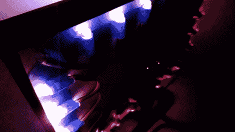

# 阿达莱特:Ladyada 的流光溢彩

> 原文：<https://hackaday.com/2011/10/05/adalight-ladyadas-ambilight/>

最新和最伟大的流光溢彩克隆产品 [Adalight](http://ladyada.net/make/adalight/) ，来自有时一天黑一次的[贡献者](http://hackaday.com/author/philburgess/) [ [菲尔·伯吉斯](http://www.paintyourdragon.com/) ]的富有成果的头脑和杂乱的工作台。

我们已经看到了飞利浦流光溢彩技术的几个克隆产品，但是【菲尔】把这一个打得落花流水。硬件是一串[12 毫米 RGB led](http://www.adafruit.com/products/322)连接到你选择的 Arduino。在使用从“激光切割丙烯酸树脂到只不过是一个披萨盒”的任何东西将 led 连接到电视背面后，它就被安装到软件上了。

处理草图执行一系列屏幕捕获，并对屏幕周边的像素进行平均。据报道，卡尔·萨根的*宇宙*用 Adalight 看起来棒极了，但是[可能有更好的选择](http://www.youtube.com/watch?v=ou6JNQwPWE0#t=30)。

[Phil]在他的 Adalight 上使用了 25 个 led，比我们在其他流光溢彩克隆产品上看到的通常的 6-10 个要多。休息之后，请观看视频，了解 Adalight 的运行情况。

<https://player.vimeo.com/video/30043456>

 </body> </html>