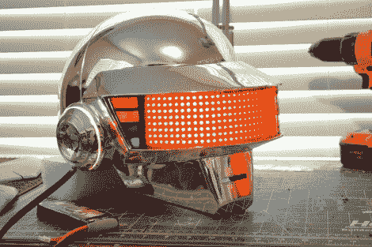

# IPhone 控制的蠢朋克头盔复制品令人眼花缭乱的建设

> 原文：<https://hackaday.com/2011/10/05/iphone-controlled-daft-punk-helmet-replica-a-dazzling-build/>

这个蠢朋克头盔复制品看起来很漂亮，但是我们越深入研究建造过程，我们越开始认为整个项目是一件艺术品。[Harrison Krix]已经为此工作了几个月，并在 9 月份发布了他的三部分构建日志。休息之后，请查看视频和所有三个部分的链接。

哈里森对道具复制场景并不陌生。他是去年我们看到的另一个神奇的蠢朋克头盔的负责人。他利用同样的制造技术生产出了同样令人印象深刻的镀铬头盔，配有可寻址的闪烁发光二极管。他建立了自己的模具来创建头盔的主体，这让我们想起了我们在 7 月份看到的[风暴骑兵头盔复制品](http://hackaday.com/2011/07/28/making-and-selling-star-wars-costumes-ruled-to-be-legal/)。当它被镀铬的时候，他开始处理电子产品。

头盔的面罩有一个红色的 LED 罩。这一点，连同彩色帽舌侧面和耳扣，由 Arduino 黄色夹克控制。这些灯可以通过一个通过 WiFi 连接到头盔的 iPhone 应用程序来控制，让用户将自定义信息推送到显示器上，并改变灯光模式。该建筑内部和外部都非常明亮，具有令人难以置信的干净 LED 矩阵结构，以及用于打开或关闭每个部件的巧妙控制位置。

[https://www.youtube.com/embed/DxjmQfeYztA?version=3&rel=1&showsearch=0&showinfo=1&iv_load_policy=1&fs=1&hl=en-US&autohide=2&wmode=transparent](https://www.youtube.com/embed/DxjmQfeYztA?version=3&rel=1&showsearch=0&showinfo=1&iv_load_policy=1&fs=1&hl=en-US&autohide=2&wmode=transparent)

**建立日志链接:**

*   [第一部分](http://volpinprops.blogspot.com/2011/02/daft-punk-helmet-thomas-part-1.html)
*   [第二部分](http://volpinprops.blogspot.com/2011/06/daft-punk-helmet-thomas-part-2.html)
*   [第三部分](http://volpinprops.blogspot.com/2011/09/daft-punk-helmet-thomas-final.html)

[Thanks Chris]