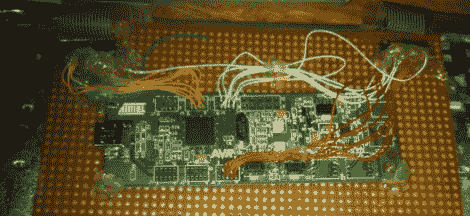

# 基于硬件的键盘重新映射

> 原文：<https://hackaday.com/2011/10/06/hardware-based-keyboard-remapping/>

[Nav]想为一个特定的键盘改变他的键盘映射，而不是在每个操作系统上。他使用 AT90USBKey 作为替代 PCB，焊接到 key matrix 上的所有触点。这允许他通过遵循屏幕提示来[重新映射按键。](http://41j.com/blog/2011/10/a-programmable-keyboard-controller/)

该板列举了一个 HID 设备，并有一个特殊的模式，这是通过插入键盘，同时按住[任何键](http://www.youtube.com/watch?v=gugbMw4LigY)访问。如果文本编辑器窗口处于活动状态，您会看到微控制器提示您按下一系列键。这是一个用来学习如何组织键矩阵的例程，这是您改变每个键的映射方式的机会。由于映射保存在 EEPROM 中，您可以使用任何计算机来映射键，然后将设备插入不提供软件重新映射的系统。假设没有延迟问题，它也可以用作游戏键盘

与基于 AVR 的街机控制器一样，这个项目使用 LUFA 包来处理 USB 堆栈。