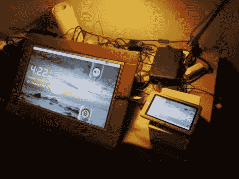

# 如何打造 23 寸安卓平板

> 原文：<https://hackaday.com/2011/10/10/how-to-build-a-23-android-tablet/>

如果你想造一个真正大的安卓平板电脑，诀窍是不要从零开始。[Peter]使用一系列容易获得的部件成功地完成了一个 23 英寸的 Android 平板电脑,将这项艰巨的工作留给了设计用来完成这项工作的硬件。

他并没有真的造出一台平板电脑，而是造出了一个很大的触摸屏插件。他手头已经有了几个便宜的平板电脑可以玩。其中一个有一个 HDMI 输出端口，这让他可以轻松地将显示器推到 23 英寸的显示器上。他知道平板电脑是一个 4 线电阻式触摸屏，但他不知道其他具有相同数量连接器的触摸屏是否可以直接交换并仍然工作。为了测试这一点，他打开了第二台平板设备，并将其触摸屏连接到第一台设备的硬件上。当他获得成功时，是时候采购几个 23 英寸的触摸屏来测试外部显示器了。正如你在休息后的剪辑中看到的，它像一个魔咒一样工作！

在[我们最近的链接帖子](http://hackaday.com/2011/10/04/hackaday-links-october-4-2011/)中看到 23 英寸的 Android 平板电脑视频后，【Peter】受到启发，写下了他的经历。

 <https://www.youtube.com/embed/eGu2meJuT4s?version=3&rel=1&showsearch=0&showinfo=1&iv_load_policy=1&fs=1&hl=en-US&autohide=2&wmode=transparent>

 </body> </html>