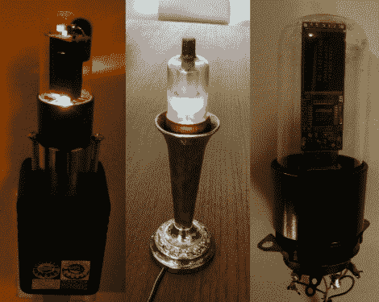

# 用真空管装饰你的房子

> 原文：<https://hackaday.com/2011/10/06/decorate-your-house-in-vacuum-tubes/>

[Autuin]写了一些分享他用闲置的真空管组装的东西。由于没有想到这些管子的其他实际用途，他四处摆弄了一下，然后[想出了几样东西](http://freegeekvancouver.blogspot.com/2011/10/vacuum-tube-hacks.html)可以放在家里，这取决于你的装饰风格。

第一件是真空管小夜灯。虽然电子管最初并不是为了熄灭灯光而建造的，但当插入合适的电源时，它们确实会发出温暖的光。[Autuin]将一个安装在壁式电源插座中，以两倍的额定电压驱动它，这提供了相当数量的光。

他的第二个作品与第一个相似，但是是为你的桌面而不是墙壁设计的。他把真空管塞到烛台里，加了电源，就收工了。真空管蜡烛实际上看起来很漂亮，稍加调整就可以很容易地做成蜡烛的样子。

他展示的最后一件物品是真空管闪存盘。它只不过是一个精心挖空的管子，里面有闪存驱动器的内脏，更适合作为一个永久的固定设备，而不是便携式存储设备。即便如此，我们认为它看起来很酷。

你用过旧真空管吗？请在评论中告诉我们！