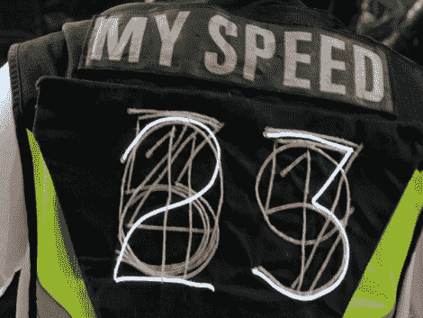

# 亮灯骑行背心向不耐烦的司机展示你的速度

> 原文：<https://hackaday.com/2011/10/07/light-up-biking-vest-shows-impatient-drivers-how-fast-you-are-going/>

[米克尔·汉森]是一名狂热的自行车爱好者，安全是他最关心的问题。他说骑自行车的人经常会收到过往司机的许多喇叭声和抱怨声，因为他们认为他们的速度比实际速度慢得多。根据[Mykle]的说法，这种误判会导致“右勾拳”碰撞，每年都会造成几名骑自行车的人死亡。为了增加他的夜间能见度，并让司机更好地了解他的行驶速度，他制作了一件自行车背心，用 7 英寸高的大数字显示他的当前速度。

他使用现成的速度计来获取自己的当前速度，并将数据输入到藏在背心内的 Arduino 中。Arduino 然后点亮相应的 EL 线数字，将他的速度传递给他后面的驾驶者。

如果下面的视频是任何迹象，它似乎工作得很好，不可否认，它会在晚上抓住司机的注意力。如果你想为自己做一个，请查看[他的制作:项目页面](http://makeprojects.com/Project/Speed-Vest/1344/1)完整地了解它是如何组装的。

 <https://www.youtube.com/embed/ngCatznaSKo?version=3&rel=1&showsearch=0&showinfo=1&iv_load_policy=1&fs=1&hl=en-US&autohide=2&hd=1&wmode=transparent>

 </body> </html>