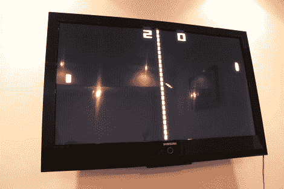

# 8 针 Micro 在您的宽屏上玩乒乓游戏

> 原文：<https://hackaday.com/2011/10/07/8-pin-micro-plays-pong-on-you-widescreen/>

[Fernando]发送了一个附带的项目更新，使用[一个 ATtiny45 在他的电视机](http://www.alfersoft.com.ar/blog/2011/09/19/tiny-pong-more-fun-with-attiny45-and-vga/)上玩 Pong。上次我们看到他的工作时，他刚刚完成 8 针[芯片，通过 VGA 端口在电视](http://hackaday.com/2011/08/31/vga-video-output-with-an-attiny/)上显示一个大数字。当他继续等待零件时，这扩展了他的想法。

现在芯片和它自己玩，但是他还有一个输入密码，我们希望看到一个简单的单人游戏增加一个按钮。我们认为桨总是朝一个方向或另一个方向移动，只要按一下按钮就可以改变方向。他正在等待的部分是一个蓝牙模块，我们希望看到它通过一对 Wiimotes 用于双人游戏(我们只是希望在这一点上，不知道这是否可能)。硬件的最终目标是为 Android 设备提供蓝牙连接记分牌。

代码是用汇编语言编写的，我们发现相对容易理解[费尔南多]对游戏逻辑做了什么。在图形方面，他获得了 120×96 的分辨率，因为 Pong 应该看起来是像素化的。我们喜欢这个结果，你可以在休息后看到。

[https://www.youtube.com/embed/8KlHqu1tnMg?version=3&rel=1&showsearch=0&showinfo=1&iv_load_policy=1&fs=1&hl=en-US&autohide=2&wmode=transparent](https://www.youtube.com/embed/8KlHqu1tnMg?version=3&rel=1&showsearch=0&showinfo=1&iv_load_policy=1&fs=1&hl=en-US&autohide=2&wmode=transparent)