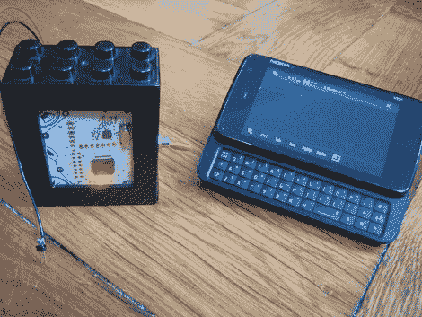

# 移动中的射频嗅探

> 原文：<https://hackaday.com/2011/10/08/rf-sniffing-on-the-go/>

我们已经有一段时间没去看望特拉维斯·古斯比了。他的最新帖子通过抛弃在计算机上显示数据的需要，使下一个希望徽章的射频嗅探更加便携。他在年初所做工作的基础上，用蓝牙模块替换了徽章上的 FTDI 芯片。现在，他可以将他的诺基亚 N900 用作 GoodFET 终端，不仅可以显示从空中提取的数据包，还可以控制徽章。

以前，计算机上运行的客户端通过串行连接与徽章通信。为了让它在 N900 上工作，[Travis]从使用 py-serial 过渡到使用 py-bluez。所有的代码修改都可以从 GoodFET 库获得。

他还为这个概念设计了一些其他的技巧。他下了一份零件订单，为 Girltech IM-ME 添加了蓝牙功能。漂亮的粉红色寻呼机上有相同的无线电芯片，因此添加蓝牙连接将允许它以相同的方式使用。也有计划在工作中添加一些其他的包嗅探协议，包括 ZigBee。