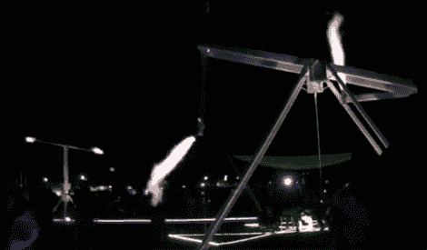

# 燃烧的人 2011:克里斯托弗·沙尔特的火箭花园

> 原文：<https://hackaday.com/2011/10/08/burning-man-2011-christopher-schardts-garden-of-rockets/>

这是我今年在《燃烧的人》中遗憾错过的一件作品，然而我确实听到了偶然发现它的人的故事。[Christopher Shardt]的火箭花园由三个动感火焰艺术作品组成，您可以控制旋转的丙烷火箭！

[克里斯托弗]决定加入他的燃烧的人 2010 项目， [4pyre](http://www.pbase.com/schardt/4pyre2) ，这是一个 12 英尺长的管道，两端各有一个以丙烷为燃料的火箭。旁观者可以控制供给火箭的丙烷量，并扭动它们所连接的管道，使整个事情像失控的消防水管一样旋转。伴随着 4pyre 的是 [PyreGoRound](http://www.pbase.com/schardt/pyrogoround) 和[pyro articulation](http://www.pbase.com/schardt/pyroticulation)，它们是 4pyre 旋转火箭棒概念的两个变体。[克里斯托弗]很幸运，他的项目材料由燃烧的人资助，但增加了三千美元(！)中的丙烷混合到口袋里。

查看跳跃后的项目视频，以及[Christopher]的[站点](http://www.schardt.org/)了解细节和示意图。

<https://player.vimeo.com/video/27183456>

 <iframe class="youtube-player" width="800" height="480" src="https://www.youtube.com/embed/6DTu3qx50Us?version=3&amp;rel=1&amp;showsearch=0&amp;showinfo=1&amp;iv_load_policy=1&amp;fs=1&amp;hl=en-US&amp;autohide=2&amp;wmode=transparent" allowfullscreen="true" style="border:0;" sandbox="allow-scripts allow-same-origin allow-popups allow-presentation"/> </body> </html>