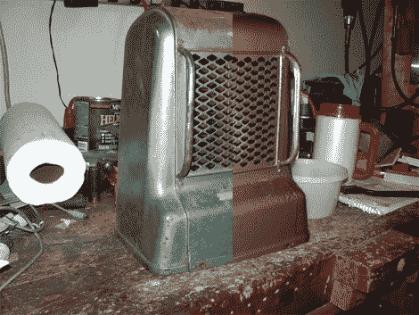

# 改造一个 60 岁的电暖器

> 原文：<https://hackaday.com/2011/10/10/retrofitting-a-60-year-old-electric-heater/>

一天，约翰在旧货店发现了一个旧的肯莫尔电暖器，他觉得放在他的浴室里会很棒。该装置的唯一问题是，它建于 20 世纪 40 年代/50 年代，因此缺乏任何现代安全措施，而这正是室内加热器所具备的。没有开/关开关，没有保险丝，没有恒温器，也没有开关——尽管它确实有一根漂亮的、包着易燃布的电源线。

由于[约翰]并不热衷于以保暖的名义烧掉自己的房子，他决定用一个新的陶瓷加热器来改造旧单元的外壳。他发现一个 20 美元的单元看起来很合适，所以他拆卸了两个加热器并开始工作。肯莫尔号的内部零件被废弃了，然后他给这个装置涂上了一层漂亮的高温油漆。新的加热器被切割成适合旧设备的外壳，控制和安全功能完好无损。

他说它非常好用，放在他的浴室里看起来也很棒。如果你正在考虑做类似的事情，一定要看看他的文章——它非常全面，有大量的细节，会在这个过程中帮助你。