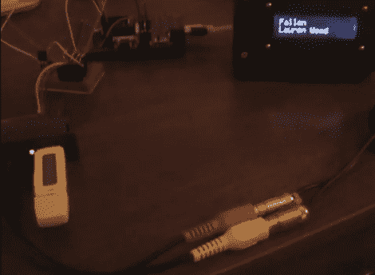

# 遥控 VMUSIC2 音频播放器

> 原文：<https://hackaday.com/2011/10/12/remote-controlled-vmusic2-audio-player/>

[罗恩]正在寻找一种不用电脑就能在家玩 MP3 的方法。他还希望能够用他放在身边的一个旧的便携式摄像机遥控器来遥控他的音乐——这完全不是你在现成的个人音频播放器中能找到的功能。

最终，他决定使用 VMUSIC2 音频模块构建自己的遥控音频播放器，该模块可以解码任何标准 USB 驱动器上的 MP3。VMUSIC2 由 Propeller 演示板控制，演示板还负责接收和解码来自摄像机遥控器的红外信号。虽然他最初是将 ID3 标签数据转储到他的计算机上进行调试，但他最近添加了一个 LCD 屏幕，以更有用的方式显示歌曲信息。

如果下面的视频有任何提示的话，MP3 播放器似乎工作得很好，尽管它在乞求一个漂亮的外壳来把东西绑在一起。到目前为止，我们喜欢这个项目，所以我们确信当它完全完成时，[罗恩]不会不留下深刻印象。

 <https://www.youtube.com/embed/-PtN7-1do6Y?version=3&rel=1&showsearch=0&showinfo=1&iv_load_policy=1&fs=1&hl=en-US&autohide=2&wmode=transparent>

 </body> </html>