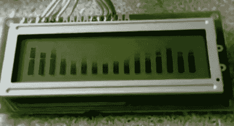

# 专用 IC 简化字符 LCD 频谱分析仪

> 原文：<https://hackaday.com/2011/10/10/character-lcd-spectrum-analyzer-made-simple-with-a-dedicated-ic/>

[El Artis]刚刚完成了使用字符 LCD 的音频频谱分析仪的制造。使用 Arduino 来驱动显示器，但与其他使用微控制器进行分析的[仪表不同的是](http://hackaday.com/2011/09/08/spectrum-analyzer-users-custom-characters-on-an-hd44780-display/)，【El Artis】使用分立 IC 来完成该任务。

该项目使用 MSGEQ7 图形均衡器显示滤波器芯片从音频源获取频率数据。该芯片使用两个数字引脚和一个模拟引脚连接到您选择的微控制器。[El Artis]向我们介绍了[J .斯科巴]关于如何使用 Arduino 的帖子，然后为 HD44780 显示器添加了他自己的自定义字符例程。您会注意到上图中有 16 个条形，这与芯片提供的 7 个输出相冲突。[El Artis]计算相邻值的平均值，以增加额外的输出。

休息之后不要错过演示视频。如果你想在你的某个项目中使用这个零件，我们注意到它们有点难找到(octopart 不返回任何供应商)，但 [SparkFun 有它们](http://www.sparkfun.com/products/10468)。

 <https://www.youtube.com/embed/EpLLqgySCD4?version=3&rel=1&showsearch=0&showinfo=1&iv_load_policy=1&fs=1&hl=en-US&autohide=2&wmode=transparent>

 </body> </html>