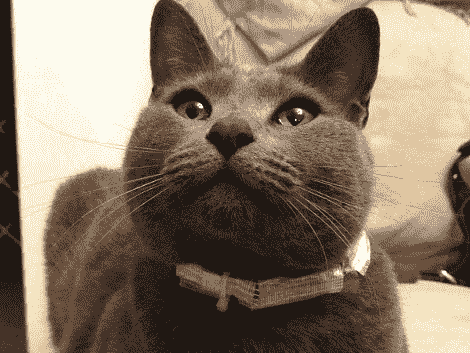

# 看看袜子在哪里用过 GPS 追踪项圈

> 原文：<https://hackaday.com/2011/10/11/see-where-socks-has-been-using-a-gps-tracking-collar/>

[Buxtronix]想知道他的猫(名为 Ash，但我们认为 Socks 听起来更俗套)在自由活动时要去哪里。他设计了一个 [GPS 追踪项圈和一种绘制它收集的数据的方法](http://www.buxtronix.net/2011/10/gps-feline-tracker.html)。

硬件实际上非常简单。他需要一个 GPS 模块来收集位置数据，并需要一种方法来存储这些信息，因为他认为直播是不可行的。他找到了 SparkFun，因为他们有一个 GPS 模块，小到足以装下一个猫项圈，并且用一个串行引脚输出数据。不幸的是，这个[模块不再提供](http://www.sparkfun.com/products/8416)，但是如果你有一个类似大小的替代模块，请在评论中告诉我们。这种器件使数据采集变得很容易，你只需要记录下流水线上的串行数据。[Buxtronix]使用了一个 [OpenLog 板](http://www.sparkfun.com/products/9530)将数据转储到 SD 卡上。当[Ash]漫游回来后，[Buxtronix]拿起 SD 卡，使用 Python 脚本将 NMEA 数据转换成 KML 格式，这种格式可以覆盖在谷歌地球和谷歌地图上。