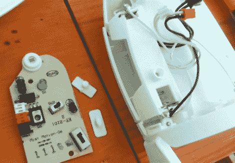

# 简单的黑客重复使用空气清新剂 PIR 传感器

> 原文：<https://hackaday.com/2011/10/11/simple-hack-reuses-an-air-freshener-pir-sensor/>

一年前[罗奇]买了一台 Airwick 自动空气清新剂，尽管他认为这是一个很酷的小玩意，清新的喷雾和新奇的东西很快就用完了。这个设备在他的房间里积了一段时间的灰尘，直到他最近发现了它，并注意到一个非常好的 PIR 传感器一直在看着他的脸。

他拆开了空气清新剂，然后开始研究如何与 PIR 传感器连接。在发现[是关于这个话题的一个有帮助的指示](http://www.instructables.com/id/Re-purposing-an-Air-Wick-Freshmatic-Compact-i-Moti/step3/Approach-1-Digitized-Sensor-Output-Simplest-way/)后，他可以完全访问传感器的信号，这使他可以轻松地将其连接到 Arduino 上。他认为每当有人进入他的房间时触发一些简单的音乐会很有趣，所以他在 RTTTL 编码了一小段超级马里奥兄弟主题，正如他在下面的视频中解释的那样。

这是一个简单的小技巧，但[Lochie]对此很满意，我们想象他可能对他新发现的 PIR 传感器有一长串其他创造性的想法。

 <https://www.youtube.com/embed/cofqYukXTow?version=3&rel=1&showsearch=0&showinfo=1&iv_load_policy=1&fs=1&hl=en-US&autohide=2&wmode=transparent>

 </body> </html>