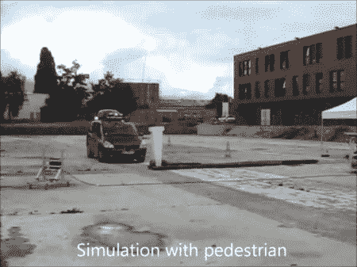

# 为忙碌的父母设计的自动小型货车

> 原文：<https://hackaday.com/2011/10/13/an-autonomous-minivan-for-busy-parents/>

尽管小型货车是父母们送孩子去学校、参加足球训练等等的主要交通工具，但这种交通工具想象着有一天他们甚至不需要这样做。自动驾驶汽车已经发展了一段时间，但休息后的视频提供了一个很好的特写镜头，展示了这种特殊的车辆是如何制造的，以及一些测试。

特别令人感兴趣的是为容纳车辆电子设备而改装的外部行李箱。每样东西都用电线导管布置得很好，以保持整洁。制造业的人可能会注意到其他几个现成的组件，包括 0:24 的区域扫描仪和 0:45 的挤压铝框架。乘客一侧明显的“紧急停止”按钮也来自工业，可能会让乘客感觉更安全一点！
[https://www.youtube.com/embed/1o04r1tuKJo?version=3&rel=1&showsearch=0&showinfo=1&iv_load_policy=1&fs=1&hl=en-US&autohide=2&wmode=transparent](https://www.youtube.com/embed/1o04r1tuKJo?version=3&rel=1&showsearch=0&showinfo=1&iv_load_policy=1&fs=1&hl=en-US&autohide=2&wmode=transparent)

如果这还不够有趣，看看谷歌的这辆自动驾驶汽车，它已经从旧金山开到洛杉矶了！