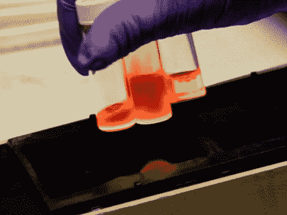

# 酝酿一些量子点

> 原文：<https://hackaday.com/2011/10/12/brewing-up-some-quantum-dots/>

我们将从后院、车库和地下室黑客中进行实地考察，以了解科学家们最近在做什么。约翰霍普金斯纳米生物技术研究所的一个小组已经在制造用于医疗领域的量子点。由硒化镉组成，这是一种纳米材料，你可以认为是最小尺寸的单个晶体。[量子点](http://en.wikipedia.org/wiki/Quantum_dots)有很多用途。在这里，[Charli Dvoracek]利用最近制造的 dots，用能够靶向癌细胞的抗体激活它们。一旦与生物样本混合，这些点就会嵌入癌细胞的壁中，由于这些点的磷光特性，研究人员可以找到这些细胞。

广告之后的视频带我们经历了种植这些小点的各个步骤。[Charli]有一个设备齐全的实验室，使用像充氩手套箱这样的工具来保护她免受有害废气的影响。你的家庭实验室里不太可能有这种东西，但是正如我们之前看到的，你可以[用自己的设备](http://hackaday.com/2011/06/16/making-your-own-lab-instruments/)，[用简单的过程生产有趣的化学物质](http://hackaday.com/2010/10/19/more-el-chemistry-luminescent-ink/)。如果你已经开始摆弄化学实验，我们想听听你的经历，所以[请告诉我们你在做什么](http://hackaday.com/contact-hack-a-day/)。

[https://www.youtube.com/embed/s3H0_8TLs-A?version=3&rel=1&showsearch=0&showinfo=1&iv_load_policy=1&fs=1&hl=en-US&autohide=2&wmode=transparent](https://www.youtube.com/embed/s3H0_8TLs-A?version=3&rel=1&showsearch=0&showinfo=1&iv_load_policy=1&fs=1&hl=en-US&autohide=2&wmode=transparent)

[谢谢艾伦]