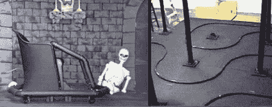

# 万圣节黑客:在车库里建造黑暗之旅

> 原文：<https://hackaday.com/2011/10/12/halloween-hacks-building-a-dark-ride-in-a-garage/>

几年前，瑞克·墨菲在他的车库里建造了一个黑暗之旅，而不是通常的南瓜灯和令人毛骨悚然的万圣节装饰品。

如果你从未有幸亲眼见过，黑暗之旅是一个基于轨道的鬼屋，可以坐在小推车上体验。通常以声音、灯光和电子动画显示为特色，黑暗游乐设施现在可以和你八岁时一样有趣。

[里克]的黑暗之旅，“黑暗中的尖叫”是在他的两个车库里用几年时间建成的。经历了这次旅程的孩子们真的很害怕，但这让排队的孩子们更加好奇——这正是[瑞克]想要的反应。

该构建在很大程度上是完全模块化的。[轨道](http://hackaday.com/wp-content/uploads/2011/10/track.jpg)由 4 英尺见方的面板组成，有直线轨道或 90 度弯道。模块化设计意味着[Rick]的车库不需要一整年都是黑暗的。在几个齿轮马达和 12 V 电池的帮助下，手推车在这个弯曲、凸起的轨道上行驶。

有一个很棒的黑暗之旅内部画廊和休息后的视频。如果你想建造自己的黑暗之旅，可以去 dafe.org 的找一群黑暗之旅和有趣的房子爱好者。

[https://www.youtube.com/embed/6HCDS-8kNtc?version=3&rel=1&showsearch=0&showinfo=1&iv_load_policy=1&fs=1&hl=en-US&autohide=2&wmode=transparent](https://www.youtube.com/embed/6HCDS-8kNtc?version=3&rel=1&showsearch=0&showinfo=1&iv_load_policy=1&fs=1&hl=en-US&autohide=2&wmode=transparent)