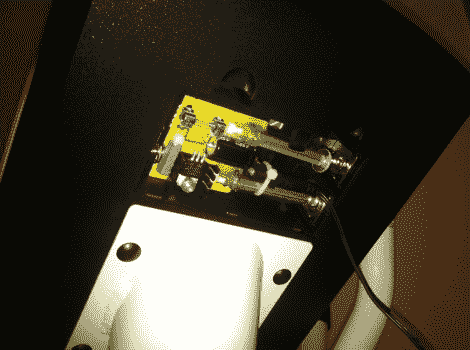

# 用于锻炼设备的非侵入式交流电源适配器

> 原文：<https://hackaday.com/2011/10/13/non-invasive-ac-power-adapter-for-exercise-equipment/>

我们经常看到电池供电的硬件，并对扔掉一次性电池的浪费摇头。有一些设备可以最大限度地减少浪费，比如那些似乎永远不需要新电池的电视遥控器。但是[奎因·邓基]在她的椭圆训练机中不断更换的 C 细胞每次只能维持大约三个月。制造商没有足够重视在机器中内置电源插孔，因此[她在不修改库存硬件](http://quinndunki.com/blondihacks/?p=576)的情况下构建了自己的交流适配器。

她做的第一件事是在两块电池之间接上几根电线。这让她可以测量电流消耗，最高约为 200 毫安。这是一个好消息，因为这很容易用廉价的线性调节器获得。从垃圾箱里拿出一个 12V/1A 壁式变压器，只需要一根保险丝和一些电容器就可以完成一个电压调节器电路。

由于[Quinn]不想永久性地改变训练器，她想出了一种方法，它可以占用与电池相同的物理空间。两个长支架用作连接电池盒中弹簧端子的插脚。它们附着在一块承载其余电路的原板上。现在她只需要记住每次治疗后把这个从墙上拔下来，她就可以开始工作了。