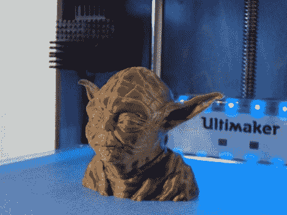

# Ultimaker 质量常见问题就像 3D 打印机的色情

> 原文：<https://hackaday.com/2011/10/13/ultimaker-quality-faq-is-like-porn-for-3d-printers/>

你认为基于挤压机的 3D 打印机真的不可能获得惊人的分辨率吗？你错了，这篇关于 Ultimaker 可达到的打印质量的文章证明了这一点。上面看到的尤达半身像是用 0.02mm 的层厚打印出来的，这本身就是一个黑客行为，因为这个过程实际上使用了两种不同的层厚。印刷的内部，你看不到，但作为物体的支撑机制，印刷厚度为 0.04 毫米，只有可见的周边印刷在较小的厚度。如果结果是这样的话，这种诡计对我们来说是没问题的。

[Dave Durrant]讨论了 Ultimaker 收到的压力，主要集中在该硬件使用的相对快速的打印过程上。但是他不认为你可以用这个设备获得高质量的故事正在被讲述。因此，他在邮件列表上发出呼吁，要求发送高质量的 3D 打印照片，他对回应并不失望。你会看到半身像、身体、齿轮、动物和艺术品的图像。有关于它们是如何打印的信息，但即使那些对细节不感兴趣的人也会喜欢微距摄影，它让你近距离地看看我们在这些桌面快速成型机方面取得了多大进展。

[谢谢泰勒]