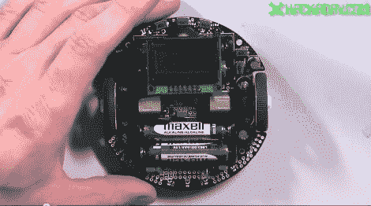

# 视频:学习为 ATmega328p 编程第一部分

> 原文：<https://hackaday.com/2011/10/14/video-learning-to-program-for-the-atmega328p-part-i/>

你们很多人都熟悉 Arduino。你们中的许多人讨厌它…*这个帖子不是关于 Arduino 的。它是许多 Arduino 主板的核心处理器。如果你处在不能理解为什么别人如此不喜欢 Arduino 的人的阵营，这个系列就是为你准备的。在这一系列视频中，[Jack]将探索如何使用 c 语言为 ATmega328p 处理器编程。如果您一直在为 Arduino 编程，您可能会遇到一些代码速度问题。用 C 语言编程可以让你用尽 ATmega 处理器所能提供的最后一点处理能力。它还允许您直接访问处理器上的外设，并在您需要更多(或更少)功能时在不同的处理器之间切换。

在第一个视频中，[Jack]向您展示了 3pi 机器人的所有功能，他将把它用作 ATmega328p 的奇特开发板。然后，他向您展示如何设置您的开发环境，并带您浏览为 3pi 机器人提供的一个示例程序。

*在 Hackaday，我们在正在进行的 Arduino 爱恨之战中正式保持中立。我们不关心我们展示的黑客使用的是什么微控制器，只关心它们很酷。

视频在休息之后！
 <https://www.youtube.com/embed/PzCnNKQGm9Y?version=3&rel=1&showsearch=0&showinfo=1&iv_load_policy=1&fs=1&hl=en-US&autohide=2&wmode=transparent>

 </body> </html>